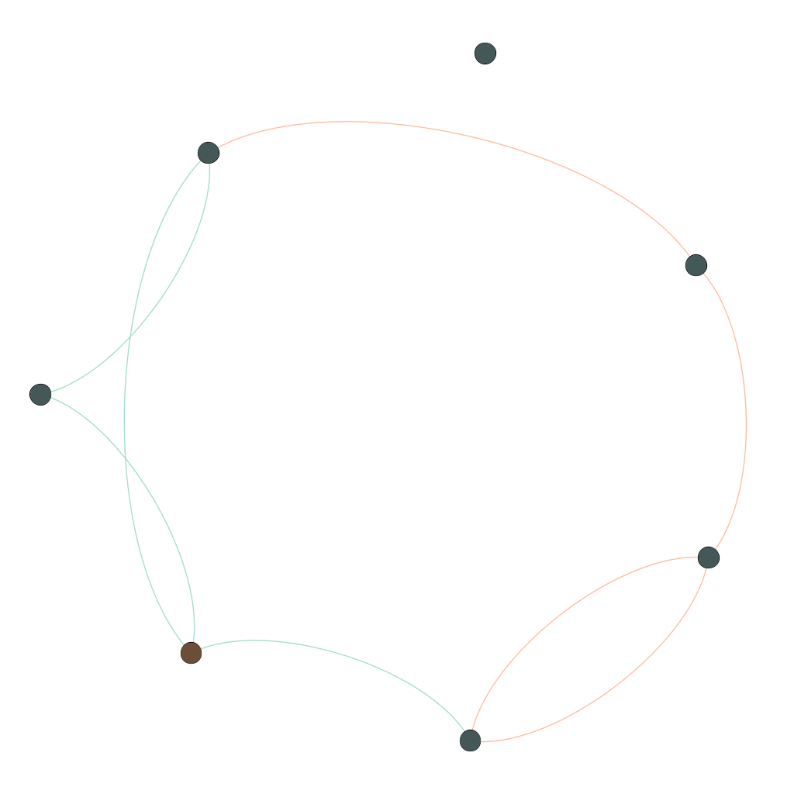

# graph playground

The graph looks like a couple of friends connected to each other:
```
---+---------+-----+
| id|     name|fraud|
+---+---------+-----+
|  a|    Alice|    1|
|  b|      Bob|    0|
....
|  f|    Fanny|    0|
|  g|    Gabby|    0|
|  h|Fraudster|    1|
+---+---------+-----+
```

and two different types of edges
```
+---+---+------------+
|src|dst|relationship|
+---+---+------------+
|  a|  b|        call|
|  b|  c|         sms|
....
|  a|  h|        call|
|  f|  h|        call|
+---+---+------------+
```
which looks like 


## goal
Calculate the fraud percentage score for each friend in the social network as the mean of all interactions.
- differenciate by type of interaction
- differenciate by ingoing / outgoing interaction
- weight interactions furhter away i.e. of friends of friends with a smaller weight

Task:
- learn pregel
- learn aggregate messages operator :)